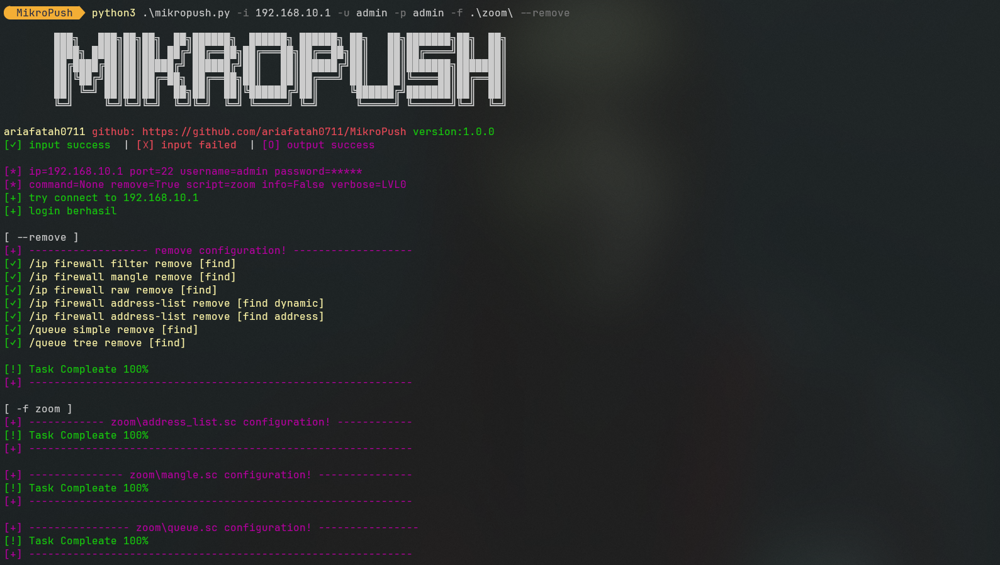

# MikroPush
## Aplikasi Network Automation untuk MikroTik

<p align="center">
  <a href="#description">description</a> •
  <a href="#table-of-contents">table of contents</a> •
  <a href="#download">Download</a> •
  <a href="#related">Related</a> •
  <a href="#license">License</a>
</p>

<p id="description"></p>

## 🚀 Description
- automation networking untuk push script ke dalam mikrotik

[](https://youtu.be/rixg3n8MfS4)

<p id="table-of-contents"></p>

## 📋 Table of Contents
<details open>
  <summary><b>installasion</b></summary>

  ```bash
  git clone https://github.com/ariafatah0711/MikroPush
  cd MikroPush
  pip3 install -r req.txt
  ```
</details>
<details open>
  <summary><b>how to use</b></summary>

  ```
  Aplikasi Network Automation untuk MikroTik

options:
  -h, --help            show this help message and exit
  -i IP                 Alamat IP dari MikroTik yang akan diakses (contoh: 192.168.88.1)
  -P Port               Port SSH untuk koneksi (default: 22)
  -u Username           Username untuk login ke MikroTik
  -p Password           Password untuk login ke MikroTik
  -v, --verbose         Aktifkan mode verbose: -v (tampilkan perintah), -vv (tampilkan perintah dan hasil perintah)
  -c Command            Perintah sederhana (contoh: 'ip add print
  -s Script             File script yang berisi perintah untuk dieksekusi
  -f Folder, -F Folder  Folder yang berisi beberapa script untuk dieksekusi
  -I, --info            Tampilkan informasi sistem MikroTik (location: scripts/info.sc)
  -R, --remove          Hapus konfigurasi dari MikroTik (location: scripts/remove.sc)
  ```
</details>

<details open>
  <summary><b>example</b></summary>

  ```bash
Contoh Penggunaan:
  python3 mikropush.py -i 192.168.88.1 -u admin -c "file print"
  python3 mikropush.py -i 192.168.88.1 -P 2020 -u admin -s script.sc -v
  python3 mikropush.py -i 192.168.88.1 -P 2020 -u admin --remove --info -s script.sc
  python3 mikropush.py -i 192.168.88.1 -u admin -p admin -f zoom

script penggunaan:
  comment script: "# ", "; "
  file script   : *.sc*
  ```
</details>

<details>
  <summary><b>create template script</b></summary>

  - ```#, ;``` script command example:
  ```
  ; example
  # input suc
  /system identity set name=MikroPush

  # input failed
  hostname MikoPush

  # output
  /ip firewall filter print
  /ip firewall nat print
  /ip firewall mangle print
  /ip firewall raw print

  /queue simple print
  /queue tree print
  ```
  - file script example:
  ```
  queue.sc
  mangle.sc
  ```
</details>

<p id="download"></p>

## 🔨 Download

1. Open a terminal or command prompt on your computer.
2. Navigate to the directory where you want to save this project.
3. Use the following command to download the project from the GitHub repository:
```sh
git clone https://github.com/ariafatah0711/MikroPush.git
cd MikroPush
pip3 install -r req.txt
```

<p id="related"></p>

## 📈 related
<!-- <a href="https://ariafatah0711.github.io/MikroPush/" alt="DEMO"></a> -->

<p id="license"></p>

## ©️ license
<a href="https://github.com/ariafatah0711" alt="CREATED"></a>
<a href="https://github.com/ariafatah0711/MikroPush/blob/main/LICENSE" alt="LICENSE"></a>